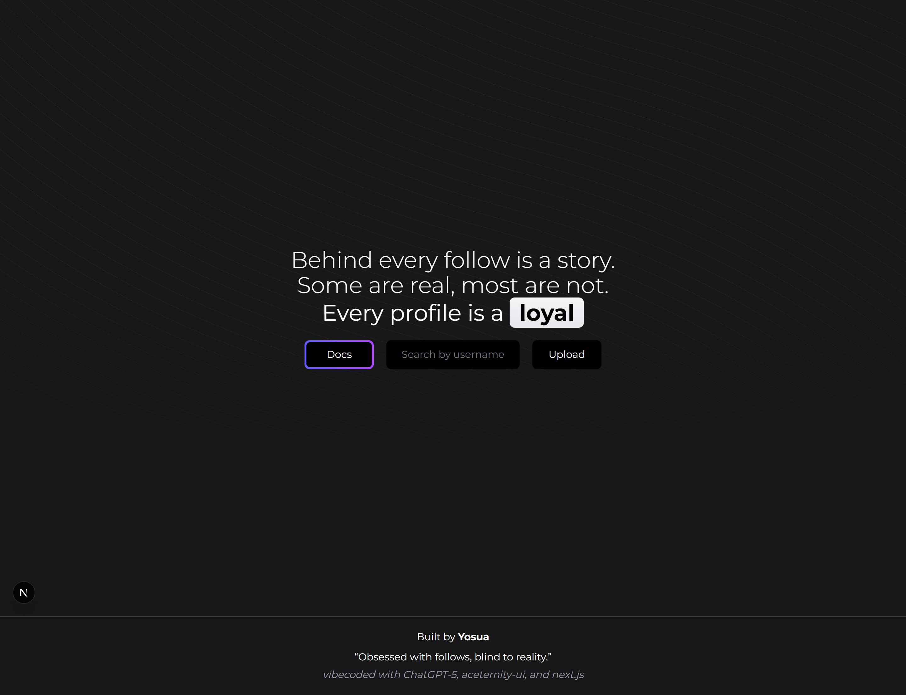
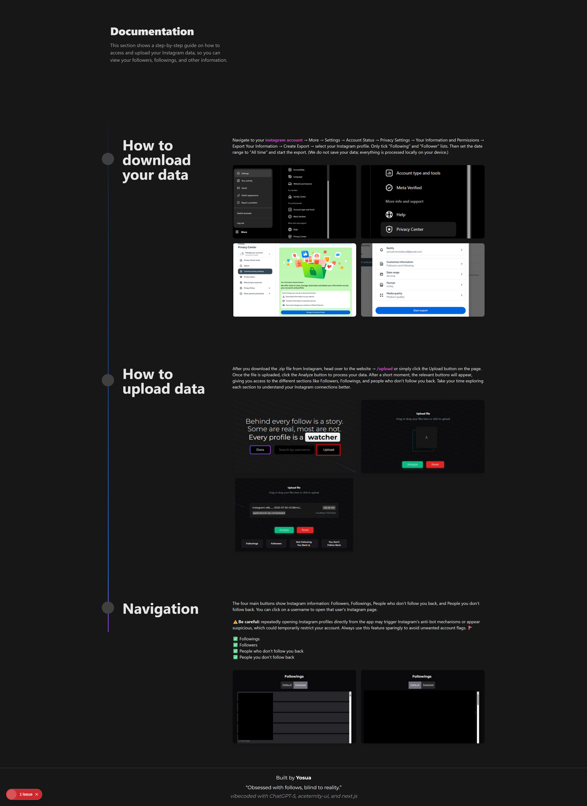
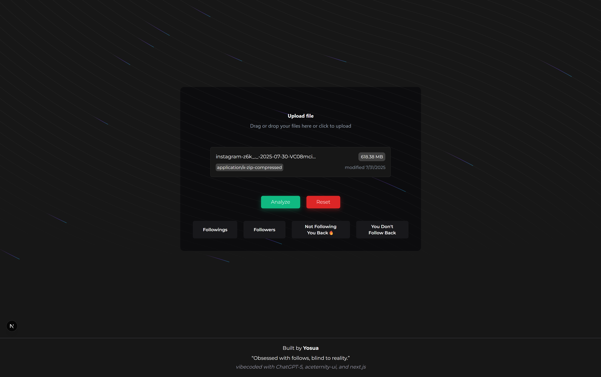
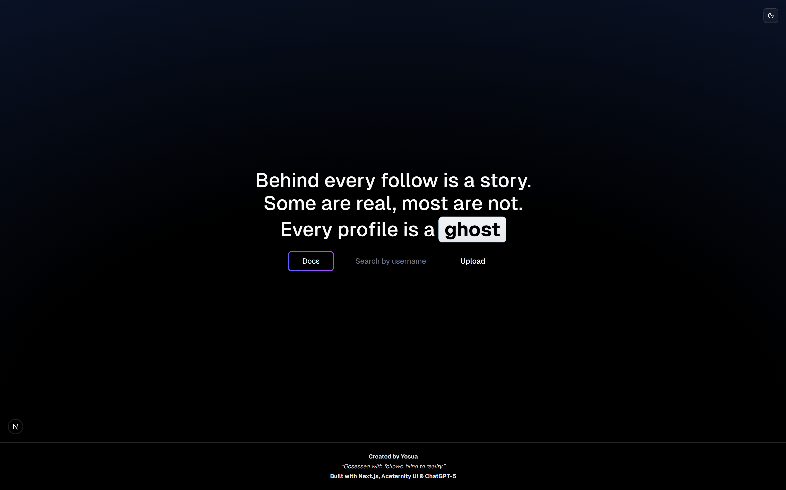
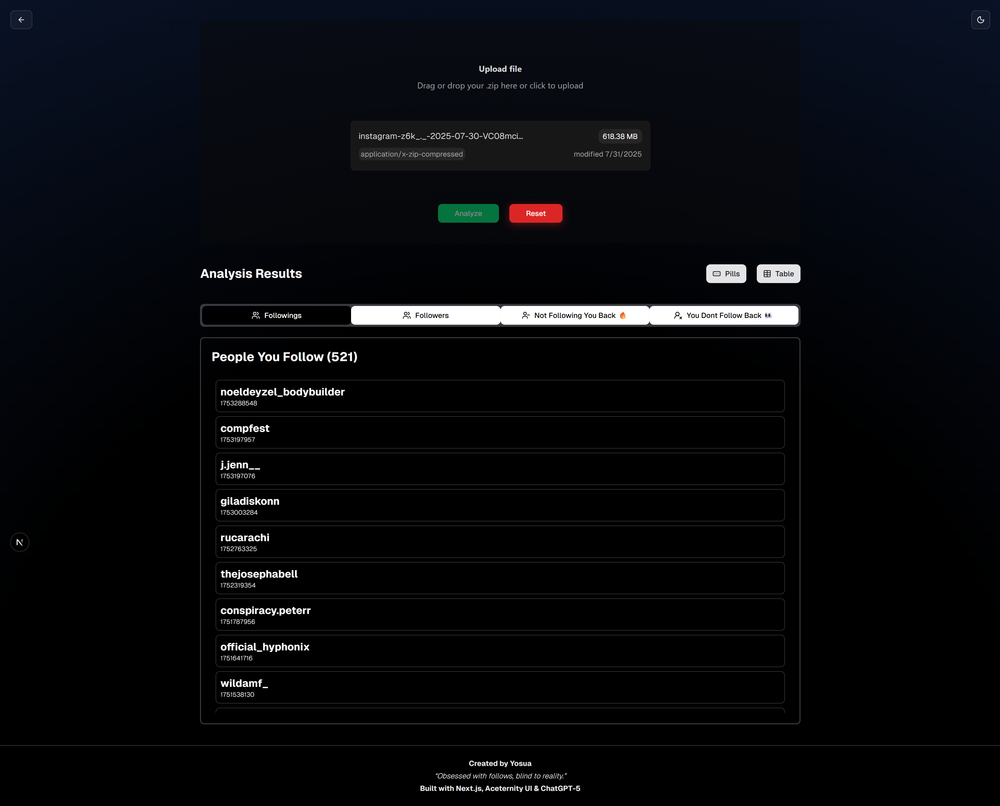
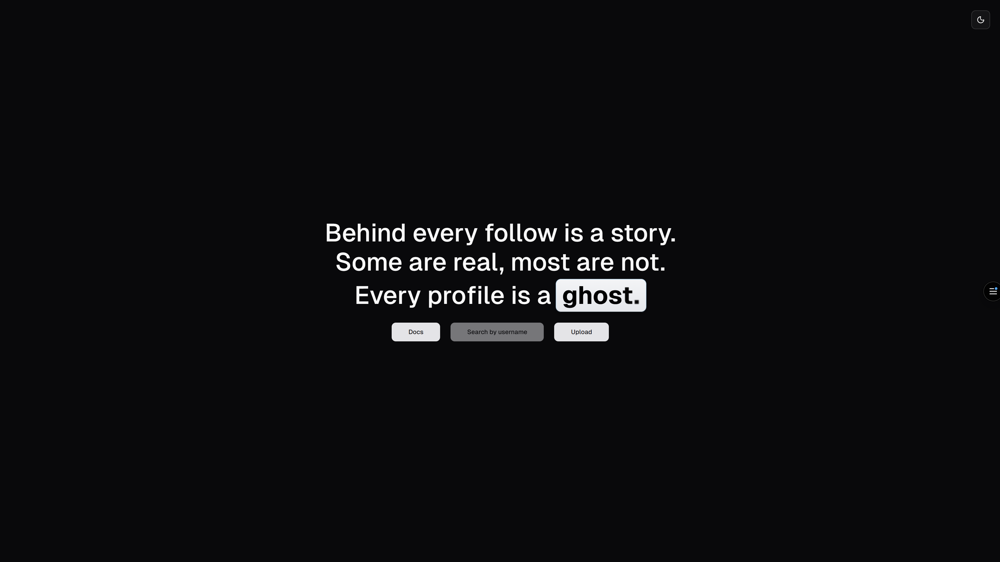
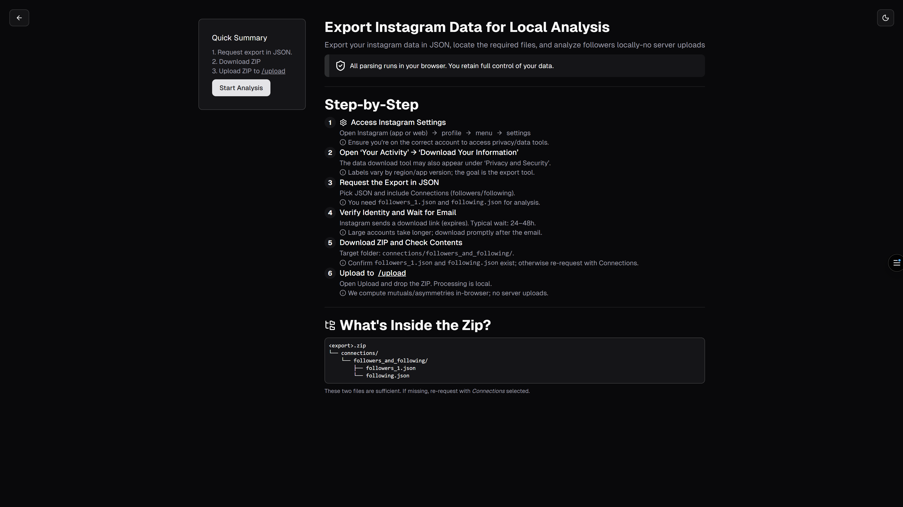
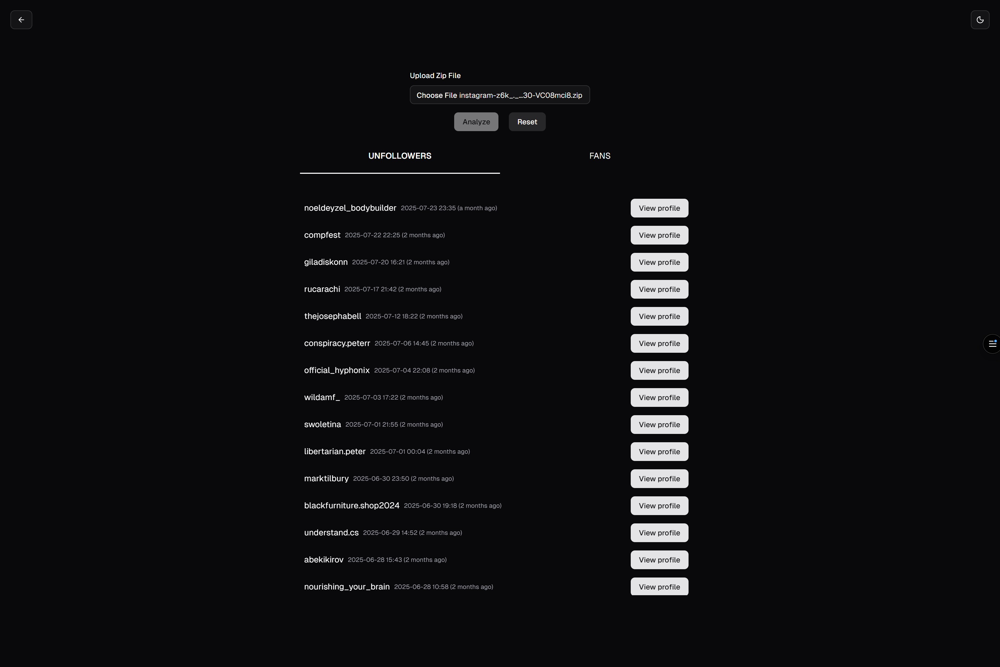

# Instagram Local Comparison Tool

This project started out as me just messing around with some new UI libraries and trying to build something based on an idea from my brother. The idea was to check who your unfollowers and fans are on Instagram without using shady third-party apps or websites. Everything happens locally. The flow is simple: you download your Instagram data (followers + followings), upload it into the site, and it compares the lists to show your followings, followers, unfollowers, and fans. I even added a search by username button at one point, but since that would require external API usage (and that’s kinda against Instagram’s rules), I just disabled it.

---

## v1
The first version where I played around with **[Aceternity UI](https://ui.aceternity.com/)**. I also experimented with some background styling. The core logic of comparing followers and followings was built here. It worked, but the UI was messy. I also added a search button that didn’t actually do anything.

  

  

  

---

## v2
Here I started experimenting with **dark mode** and used **[PatternCraft.fun](https://patterncraft.fun/?ref=dailydev)** for generating background patterns. The UI looked better than v1 and felt like a step up, but overall it was still rough. Instead of polishing it further, I decided to move on.

  

  

  

---

## v3
This version feels the cleanest so far. I combined **[shadcn/ui](https://ui.shadcn.com/)** with **[Aceternity UI](https://ui.aceternity.com/)** to build a more minimalistic UI. Dark mode works properly here, and I simplified the comparison by removing followers/followings and only showing **unfollowers** and **fans**. At this point, the design feels stable and good enough to stop for now.

  

  

  

